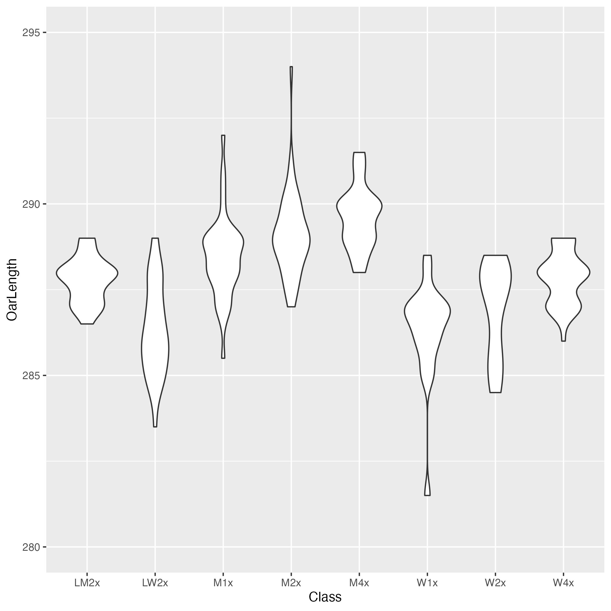
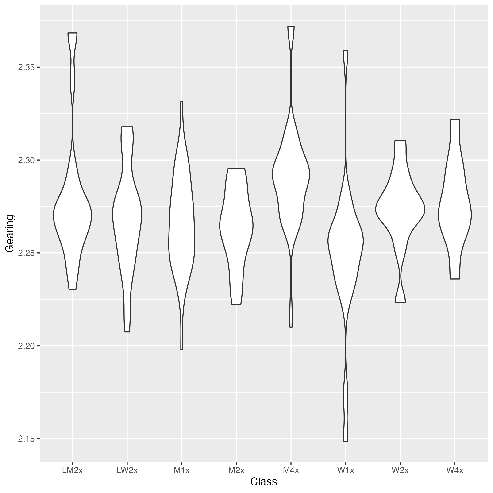

# Rigging Survey

This repository imports the [2017 FISA Rigging Survey] as an SQLite
database. The original data contains some errors and inconsistencies
that the import tries to clean up.

    sqlite> select Class, count(*) from rigging group by Class order by Class;
    +-------+----------+
    | Class | count(*) |
    +-------+----------+
    | LM2x  | 44       |
    | LW2x  | 36       |
    | M1x   | 40       |
    | M2-   | 33       |
    | M2x   | 40       |
    | M4-   | 60       |
    | M4x   | 58       |
    | M8+   | 96       |
    | W1x   | 22       |
    | W2-   | 22       |
    | W2x   | 28       |
    | W4-   | 48       |
    | W4x   | 36       |
    | W8+   | 65       |
    +-------+----------+

## Files

* survey.csv - orginal survey data
* rigging.csv - pre-processed survey data
* export.csv - re-exported survey data; use this

[2017 FISA Rigging Survey]: https://worldrowing.com/document/2017-rigging-survey/

## Sculling

Gearing is defined here as length/inboard.
