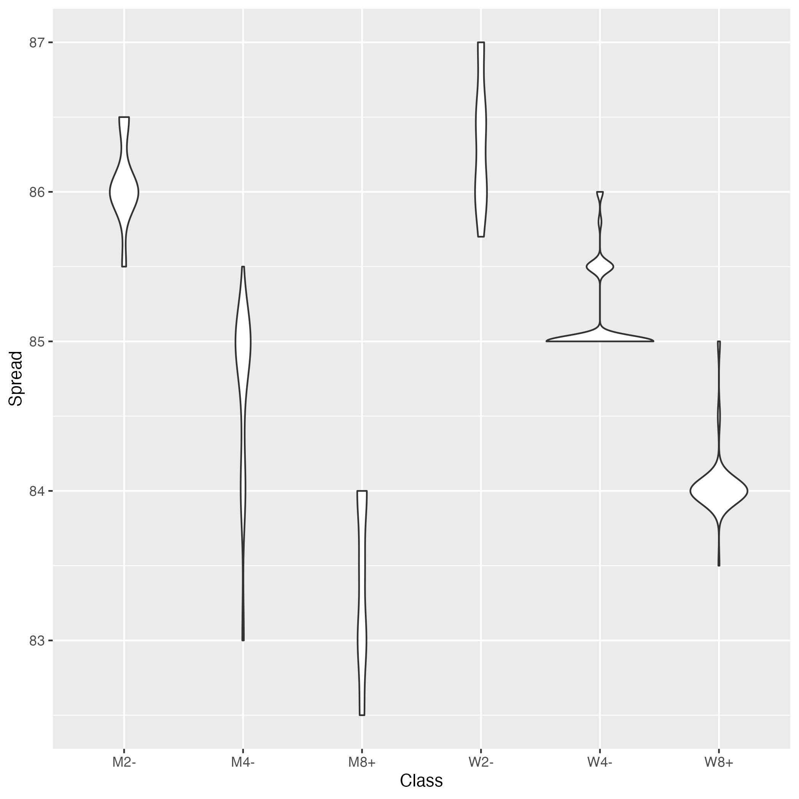

# Rigging Survey

This repository imports the [2017 FISA Rigging Survey] as an SQLite
database. The original data contains some errors and inconsistencies
that the import tries to clean up. The original spreadsheet is difficult
to use for automated analysis and this repository tries to improve on
this. All dimensions are in centimeters.

FISA (Fédération Internationale des Sociétés d'Aviron) is the
International Rowing Federation. Rigging refers to setup of a rowing
boat to best accomodate athletes. Important dimensions include oar
length, oar inboard, span and spread. The survey was taken at the 2017
World Rowing Championships in Sarasota, Florida. The rigging dimensions
are thus reprensentive for elite athletes.

The table below shows the number of entries in the survey by boat class.

| Class | Entries |
|-------|----------|
| LM2x  | 44       |
| LW2x  | 36       |
| M1x   | 40       |
| M2-   | 33       |
| M2x   | 40       |
| M4-   | 60       |
| M4x   | 58       |
| M8+   | 96       |
| W1x   | 22       |
| W2-   | 22       |
| W2x   | 28       |
| W4-   | 48       |
| W4x   | 36       |
| W8+   | 65       |

## Cleaned-Up Data

The cleaned-up data from the survey is included in the repository as
[export.csv](export.csv). Use this file if you don't want to work with
the database directly.

## Erronous Data

The dataset includes entries where I suspect dimensions where either not
measured correctly or entered wrong into the original spreadsheet:

| Class | Country | Seat | OarInboard |
|-------|---------|------|------------|
| W8+   | RUS     | 2    | 110.5      |
| M8+   | GBR     | 2    | 110.5      |
| W1x   | SUI     | 1    | 85         |

| Class | Country | Seat | OarLength |
|-------|---------|------|-----------|
| W1x   | GER     | 1    | 275.5     |

## Variables

Below is the list of variables captured for for each seat in the survey.

*   "Olympic" TEXT
*   "Class" TEXT
*   "Finish" number
*   "Country" TEXT
*   "BoatManufacturer" TEXT
*   "BoatModel" TEXT
*   "Rigger" TEXT
*   "Mount" TEXT
*   "Backstay" TEXT
*   "Seat" number
*   "Span" number
*   "Spread" number
*   "OarManufacturer" TEXT
*   "OarModel" TEXT
*   "OarShaft" TEXT
*   "OarLength" number
*   "OarInboard" number
*   "OarOutboard" number
*   "BladeShape" TEXT
*   "BladeLength" number
*   "BladeWidth" number
*   "VortexEdge" TEXT
*   "WorkTrough" number
*   "WorkHeels" number
*   "WorkToes" number
*   "StretcherAngle" number
*   "SwivelAboveSeatStarboard" number
*   "SwivelAboveSeatPortside" number
*   "SwivelAboveSeatSweep" number
*   "SeatAboveHeels" number
*   "PitchStarboard" number
*   "PitchPortside" number
*   "PitchSweep" number

## Sculling

Gearing is defined here as ratio of oar outboard to inboard.

## Sweep Rowing

Gearing is defined here as ration of oar outboard to inboard.

[2017 FISA Rigging Survey]: https://worldrowing.com/document/2017-rigging-survey/

